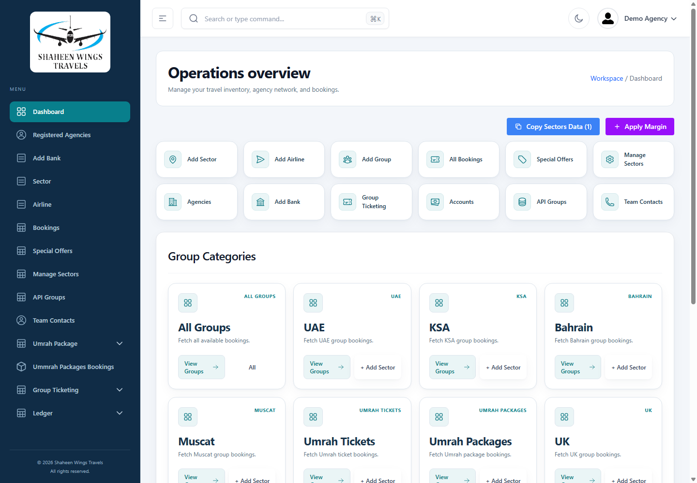
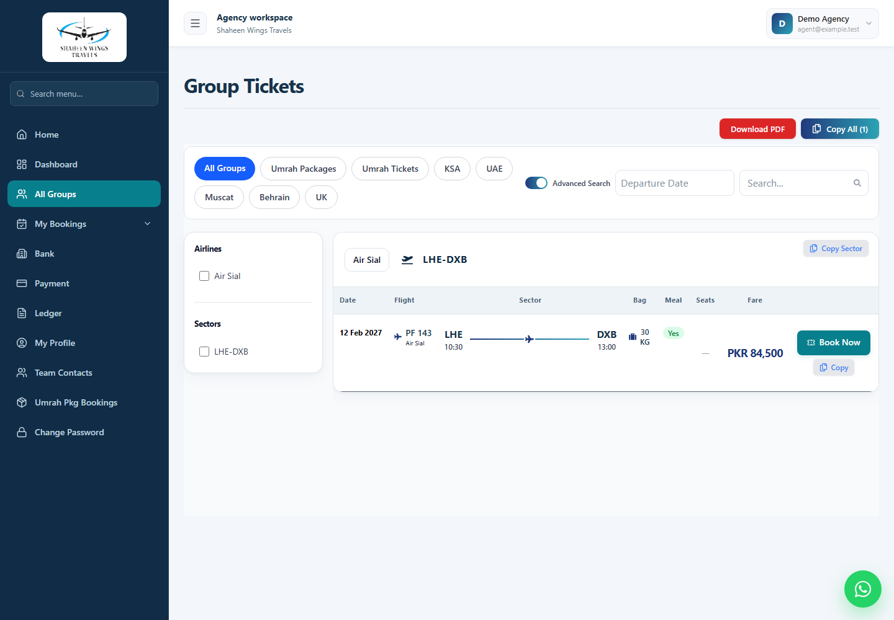

# Travel workspace UI

Both apps now use a navy and teal visual system, quieter surfaces, consistent typography, subtle borders, and compact navigation. The styling lives in `admin/src/travel-ui.css` and `frontend/src/travel-ui.css`, imported after each app's existing styles. Their shared foundation tokens are intentionally identical so both apps remain independently buildable and deployable.

## Presentation changes

- Admin: navigation shell, overview, shortcuts, categories, agency statistics, sign-in, reusable cards/buttons/modals, table styling, and chart typography.
- Agency portal: navigation shell, dashboard, sign-in, destination cards, search toolbar, filters, flight inventory, booking summary and passenger tables, and profile form.
- Common: field rounding, visible keyboard focus, date-picker contrast, table separators, horizontal scrolling, restrained shadows, mobile sizing, and reduced-motion support.
- Flight inventory retains every existing column, price expression, restriction, and action. At desktop widths the booking action stays visible when the table scrolls. Existing mobile drawers, filters, and navigation behavior are retained.

Components were changed only through presentation attributes, styling imports, display copy, and static markup. APIs, backend files, authentication, permission checks, state, payloads, routes, validations, pricing calculations, and event handlers were not changed. No dependencies were added.

## Verification

- Production builds passed for admin (`tsc -b` and Vite) and frontend (Vite).
- Both builds retain their existing large-bundle warnings.
- An AST comparison against the starting revision confirmed the edited components retain their non-presentation code and JSX expressions/handlers. Styles, static display copy, and CSS imports were excluded from that comparison.
- Headless Chrome checks covered desktop (1440px), tablet (820px), and mobile (390px) layouts. Tested pages included both dashboards, flight inventory, booking entry, profile, agency management, both sign-in screens, mobile navigation, the margin modal, and admin dark mode.
- Checked pages had no page-level horizontal overflow or uncaught runtime exceptions. Wide tables keep their internal scrolling.
- Browser previews used intercepted local demo API responses. Live authentication, supplier responses, booking submission, payment, and exports were not exercised end to end.

## Previews

These screenshots use demo data, not production records.

